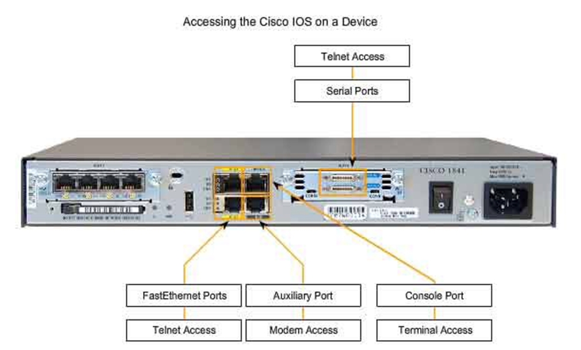

pr3-conf

# Практическая работа №3. Подключение к устройствам

Цель: овладеть навыками работы в PacketTracer и выполнить начальную конфигурацию коммутатора для режима удалённой работы.

В зависимости от условий подключения устройств в среде Ethernet, существуют дуплексный и полудуплексный режимы передачи. В первом случае отсутствует необходимость в работе механизма избежаний коллизий CSMA/CD, т.к. устройства \(например, свитч и ПК\) используют разные пары витого кабеля для передачи для каждого направления – наиболее распространённый вариант на сегодняшний день. При подключении устройств через концентратор \(hub\) работа осуществляется в полудуплексном режиме. Для автоматического выбора режима работы портов, существует механизм Auto-MDIX \(automatic medium-dependent interface crossover\), который на всех подключённых устройствах автоматически настраивает режимы передачи \(дуплекс, полудуплекс\), скорость подключения \(10, 100, 1000 Мбит/с и т.д.\) и тип подключения кабелей \(crossover, straight-through\) на интерфейсах.

Конфигурация сетевых устройств Cisco должна выполняться в CLI \(Command Line Interface – командная строка\). При физическом подключении к оборудованию, доступ к CLI можно получить через сеанс консоли, доступной через Console порт. Консоль использует низкоскоростное последовательное соединение для непосредственного подключения компьютера или терминала к консоли. Консольный порт – это порт управления, который обеспечивает внеполосный доступ к маршрутизатору. Консольный порт доступен, даже если на устройстве не настроены сетевые службы.

Примерами использования консоли являются:

* Начальная конфигурация сетевого устройства

* Процедуры аварийного восстановления и устранение неполадок, когда удаленный доступ невозможен

* Процедуры восстановления пароля

Другой способ установить сеанс CLI удаленно – через телефонное коммутируемое соединение, используя модем, подключенный к порту AUX маршрутизатора. Подобно консольному соединению, этот метод не требует настройки или доступности каких-либо сетевых сервисов на устройстве. Порт AUX также можно использовать локально, например, консольный порт, с прямым подключением к компьютеру, на котором запущена программа эмуляции терминала. Как правило, порт AUX используется локально вместо консольного порта, когда возникают проблемы с использованием консольного порта, например, когда параметры подключения к консоли неизвестны.




Важным режимом подключения к устройству является подключение через VTY линии, на которых может быть настроено удаленное подключение по протоколам прикладного уровняTelnet или SSH. Telnet -- достаточно старая технология, которая может быть использована только в безопасных сетях, т.к. передаваемые данные не шифруются и могут быть скомпрометированы.  SSH же может быть использован для удаленной настройки оборудования даже из Интернета -- данные передаются только в зашифрованном виде.

Приступая в работе, соберите схему, как показано на Рисунке ниже.


В PacketTracer для доступа к CLI кликаем по устройству и открываем вкладку CLI. Вид префикса пригласительной строки обозначает текущий режим конфигурации – User EXEC Mode:

```
Switch>
```

В данном случае возможно использование только базовых возможностей, таких как просмотр некоторых свойств конфигурации, выполнение команды ping и т.д. Вход в привилегированный режим \(Privileged Mode\) осуществляется следующим образом:

```
Switch>enable
```

Привилегированный режим  позволяет выполнять более широкий диапазон команд \(детальный мониторинг, дебагинг, манипуляции с файловой системой\):

```
Switch#
```

Следующий режим доступа – Global Configuration Mode, которые позволяет осуществлять детальную настройку оборудования. Вход в режим осуществляется так:

```
Switch# configure terminal
```

В целях безопасности, необходимо задать пароль на доступ к привилегированному режиму:

```
Switch(config)# enable secret password1 % пароль хранится в захэшированнном виде
```

или

```
Switch(config)# enable password password1 % пароль хранится в открытой форме
```

> % – означает комментарий, символы после этого знака вводить в консоль не нужно :\)
>
> **Рекомендация. ** Активно используйте автодополнение в консоли клавишей «Tab» и вводом «?».

Необходимо также обезопасить консольный интерфейс:

```
Switch(config)# line console 0
Switch(config-line)# password password2    %classCon
Switch(config-line)# login                %затребовать ввод пароля при входе
Switch(config-line)# exit
```

Для того, чтобы устройство получило IP-адрес, по которому будем подключаться к нему удаленно, необходимо настроить Switch Virtual Interface \(SVI\):

```
Switch(config)# interface vlan 1
Switch(config-if)# ip address 192.168.10.2 255.255.255.0
Switch(config-if)# no shutdown    %ВРУЧНУЮ активируем интерфейс 
Switch(config-if)# exit
```

При необходимости, шлюз по умолчанию для коммутатора можно натсроить следующим образом:

```
Switch(config)#ip default-gateway 192.168.10.1
```

Также необходимо вручную присвоить IP-адреса компьютерам из той же сети, которой принадлежит SVI. Проверить доступность коммутатора с ПК можно командой _ping_.

Далее ставим пароль на виртуальные интерфейсы, через которые можно осуществлять удалённую конфигурацию оборудования по Telnet:

```
Test(config)# line vty 0 15            %начинаем конфигурацию виртуальных линий (опция – 0 4)
Test(config-line)# password password3    %classVty
Test(config-line)# login            %чтобы при удалённом подключении спрашивало пароль
```

На данном этапе нам доступно подключение к оборудованию по Telnet, проверить в командной строке Windows это можно так:

```
C:\>telnet 192.168.10.2
```

Для настройки SSH, где в отличие от Telnet здесь выполняется полное шифрование аутентификационных и пользовательских данных, дополнительно выполняются следующие команды:

```
Switch(config)# hostname Test % прежде всего необходимо задать имя устройству
Test(config)# ip domain-name kaiLaba    % ...и его ip-домен
Test(config)# crypto key generate rsa    %генерация ключа шифрования, длина >=1024, кратна степени 2
Test(config)# line vty 0 15    %начинаем конфигурацию виртуальных линий (опция – 0 4)
Test(config-line)# password password3        %classVty
Test(config-line)# login    %чтобы при удалённом подключении спрашивало пароль
Test(config-line)#transport input ssh    %показываем, что будет использован SSH протокол, можно указать all, чтобы оставить Telnet активным
Test(config-line)# exit
```

После этого, попробовать выполнить подключение ПК к свитчу по SSH:

```
C:\>ssh -l admin 192.168.10.2
```

> Мы выполняли настройки для пользователя по умолчанию _admin_, значит и подлкючаемся используя этот логин. Можно также настроить своего пользователя, подробнее об этом спросите в гугле.

В целях безопасности, стоит зашифровать пароли в конфигурационных файлах, т.к. хранение в открытом виде может привести к их компрометации:

```
Test(config)# service password-encryption
```

Сохраняем текущую конфигурацию \(2 способа\):

```
Test# copy running-config startup-config
Test# write memory
```

Затем выводим в консоль ПК текущую конфигурацию свитча:

```
Switch# show running-config
```

> Используейте клавишу "пробел" для раскрытия конфигурации

**Задание**

1. Провести базовую настройку безопасности коммутатора используя свои пароли.
2. Провести настройку подключения к устройству по Telnet и убедиться в работоспособности, подключившись к нему с ПК.
3. Провести настройку подключения по SSH и вывести в командной консоли ПК конфигурацию коммутатора. Доступен ли Telnet? Почему?
