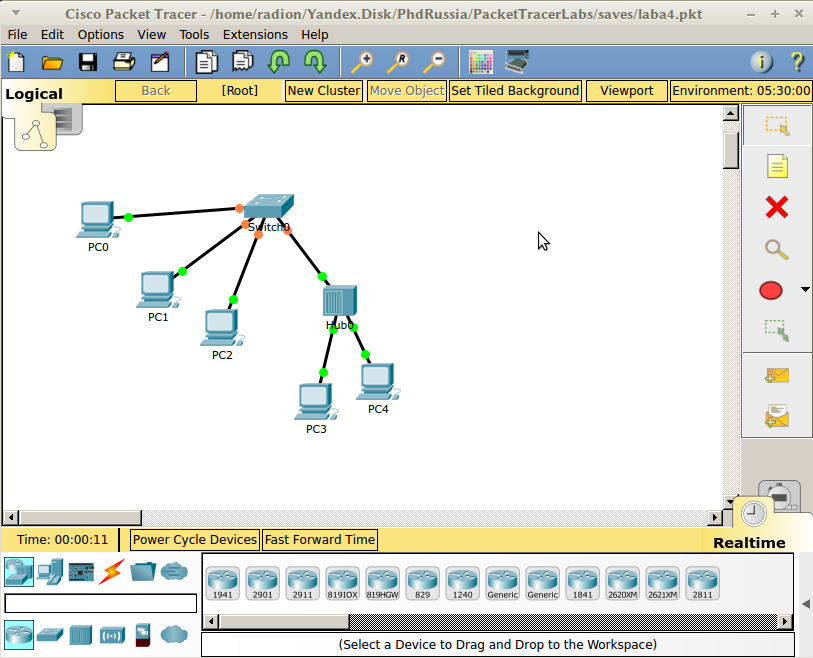

pr4-protokol-arp

# Практическая работа №4. Протокол ARP

Цель: понять принцип наполнения таблицы коммутации и работы протокола ARP.

ARP \(Address Resolution Protocol\) – протокол 3-го уровня, который обеспечивает связность между адресами 2-го и 3-го уровней в сети. Существует 4 типа ARP-сообщений:

1. Традиционный ARP
2. Proxy ARP
3. Gratuitous ARP
4. ARP probe и ARP Announcement

## Традиционный ARP

Данный протокол работает посредством сообщений Ethernet broadcast и Ethernet unicast, называемые ARP-request \(-запрос\) и ARP-reply \(-ответ\) соответственно, для выполнения 2 базовых функций:

* Определение MAC адреса устройства посредством известного IPv4 адреса.

* Наполнение ARP таблицы. По факту, в ARP таблице содержатся IP-адреса устройств и соответствующие им MAC-адреса.

Если на момент создания Ethernet-кадра ARP таблица "не знает" какой MAC-адрес нужно использовать при отправлении кадра на определенный IP-адрес, генерируется ARP запрос в виде широковещательного кадра. Тот узел, IP-адрес которого указан в запросе, генерирует ARP ответ типа unicast. После получения этого ответа, в таблице ARP формируется соответствующая запись, с помощью которой создаются Ethernet-кадры. Если в начале процесса передачи данных узел обнаруживает, что IP-адрес получателя находится в другой сети, то запрос генерируется на адрес шлюза по умолчанию, который отвечает своим MAC-адресом.

## **Proxy ARP**

Данный вид встречается в настоящее время не так часто и по умолчанию отключен на устройствах. Данный тип ARP используется в случаях, когда одному хосту нужно ответить на ARP-запрос от имени другого. Детальнее об можно почитать по ссылке: 

http://www.practicalnetworking.net/series/arp/proxy-arp/

## Gratuitous ARP

Существует также самообращенный ARP ответ, который не требует предварительного запроса и выполняется в том случае, когда хосту нужно сообщить об изменении своего MAC- или IP-адреса остальным хостам в сети. В таком запросе IP-адреса отправителя и получателя совпадают, в качестве MAC-адреса используется широковещательный. Самообращенный запрос позволяет решить задачу корректировки записи в АRP-таблицах других хостов в сети, которые содержали старую связку МАС-IP-адресов инициатора. Хост, получивший ARP-запрос c MAC-адресом, который содержится в ее таблице, должен обновить эту запись.

## ARP probe и ARP Announcement

Этот тип ARP-сообщений используется для процесса обнаружения дубликатов адресов в сети \(Duplicate Address Detection\). Они часто называется самообращенными \(gratuitous\), т.к. процесс передачи этих сообщений не инициирован другими каким-либо запросом в сети, но все же являеются самостоятельным типом сообщений из-за наличия отличного значения в поле `OpCode` в теле ARP-пакета. Когда возникает необходимость в проверке занятости какого-либо адреса в сети \(например, при работе DHCP\), хост отправляет несколько \(обычно 3\) Probe-сообщений, где MAC-адрес получателя -- **`0000.0000.0000`**, IP-адрес получателя -- интересуемый адрес. "Нулевой" MAC использован для избежания неправильного маппинга в ARP-таблицах хостов, в случае наличия дубликата адреса в сети. Если ответ не пришел, он отправляет Announcement, объявляя адрес своим.

## Наполнение таблицы коммутации

Для успешного процесса коммутации, коммутатору необходимо знать какие сетевые устройства доступны и через который порт. Подобные записи хранятся в так называемой таблице коммутации \(MAC address table\), где в качестве основных полей выступают MAC адреса устройств и порты, через которые они доступны. В процессе работы коммутатором из заголовка извлекается адрес получателя, проверяется таблица MAC-адресов на предмет совпадения и, как только оно найдено, кадр без изменений отправляется в указанный порт. Если же адрес отсутствует в таблице или кадр пришёл широковещательный, то он направляется на все порты, кроме того, откуда пришёл. Далее, при ответе адресата, его адрес коммутатор добавит в таблицу вместе с портом получения, если таковой записи не было ранее.

Для выполнения работы, соберите сеть как на рисунке ниже:





Для пошагового отслеживания сообщений в сети, в PacketTracer** нужно переключиться из режима RealTime в Simulation ** \(в правом нижнем углу окна\). В поле фильтров выбрать только ICMP и ARP пакеты. В реальной сети для подобного анализа используется ПО WireShark.

Просмотр таблицы коммутации:

```
Test# show mac-address-table
```

Для очистки таблицы коммутации выполнить:

```
Test# clear mac-address-table
```

Просмотр ARP таблицы и ее очистка на коммутаторе Cisco:

```
Test# show ip arp 
Test# clear arp-cache
```

На ОС Windows:

```
C:\>arp -a    %просмотр
C:\>arp -d    %очистка
```

**Задание**

1. Убедиться, что таблицы пусты на устройствах.

2. В режиме симуляции выполнить _ping_ PC1 с PC4. В какой очерёдности происходит отправка ARP и ICMP запросов? Почему? Сравнить таблицы на этих ПК и свитче. Чьи адреса внесены в таблицы?

3. Повторить пункт 2 \(но уже в режиме реального времени\) для PC0 и PC3. Что изменилось в таблицах?

4. Повторить пункт 3 для свитча и PC3, и затем для PC4.

5. Исходя из Ваших наблюдений, объяснить почему иногда теряется первый пакет при ICMP запросах. Сделать выводы

6. Бонус: провести работу в ПО WireShark на своем ПК. С этим бонусом работа принимается без защиты.
