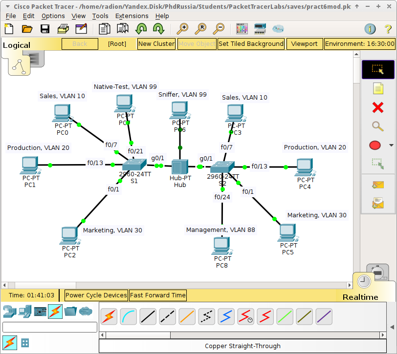

pr5-vlan

# Практическая работа №5. Технология VLAN

Цель: изучить принцип работы технологии VLAN и имплементировать ее в Packet Tracer.

VLAN \(Virtual Local Area Network\) – группа хостов \(объединённых логически\), которые находятся в общем широковещательном домене. Широковещательный домен – группа хостов, способных к получению одних и тех же широковещательных кадров Ethernet, даже если физически подключены к разным коммутаторам. Технология VLAN обычно используется для сегментации сети для упрощённого контроля над сетью за счёт ограничения коммутации трафика и для уменьшения широковещательного домена, что ведёт к повышению эффективности использования сети.

Технология реализуется за счет добавления использования опционального поля кадра Ethernet «802.1q tag», в котором содержится метка VLAN \(см. Таблица ниже\). Метка служит своеобразным разграничителем между виртуальными сетями, т.е. коммутация возможна между хостами из одной виртуальной сети -- коммутатор не будет передавать кадры хоста из одного VLAN хосту из другого VLAN. Вопросы маршрутизации между VLAN будут рассмотрены в следующей работе.

| Preamble | Start of frame delimiter | MAC destination | MAC souce | 802.1q tag \(optional\) | Ethertype | Frame check sequence CRC |
| :--- | :--- | :--- | :--- | :--- | :--- | :--- |
| 7 byte | 1 byte | 6 byte | 6 byte | 4 byte | 46-1500 byte | 4 byte |

> Поля преамбула \(Preamble\) и признак начала кадра \(SFD - Start of frame delimiter\) предназначены для синхронизации отправителя и получателя. Преамбула представляет собой 7-байтовую последовательность единиц и нулей. Поле признака начала кадра имеет размер 1 байт. Эти поля не принимаются в расчёт при вычислении длины кадра.
>
> Поля адрес получателя \(DA - Destination Address\) и адрес отправителя \(SA - Source Address\) состоят из 6 байт и содержит физический адрес устройства \(MAC-адрес\) в сети, которому адресован данный кадр и которое отправило данный соответственно.
>
> Тип протокола \(Ethertype\) – двухбайтовое поле предназначено для указания идентификатора протокола, вложившего свой пакет в поле данных кадра Ethernet.
>
> Поле данных \(Payload\) может содержать от 46 до 1500 байт, при длине поля меньше 46 байт используется заполнение кадра до минимально допустимого значения в 46 байт.
>
> Поле контрольной суммы \(FCS – Frame check sequence\) - 4 байта, содержащие значение, которое вычисляется по алгоритму CRC-32.

Можно выделить следующие применения VLAN'ов:

* **Management.** Подключения к оборудованию выполняются через выделенный VLAN, в целях безопасности
* **Voice.** ID=150, обеспечивает приоритезацию трафика.
* **Data.** Используется для передачи любых типов данных. 

Различают Trunk \(тегированный\) и Access \(нетегированный\) режимы работы портов в VLAN. Первые выступают как «магистральные», обеспечивая передачу тегированного трафика от различных VLAN _между свитчами,_ когда как вторые являются портами доступа для хостов. По умолчанию на Trunk разрешена передача всех VLAN.

Клиенты обычно подключаются к нетегированным портам – Access портам, которые могут работать только с одним VLAN. При коммутации кадра с Access-порта на Trunk-порт, свитч ставит 802.1q тэг и пересчитывает хэш-сумму кадра, если наоборот – тэг снимается.

Есть еще особый тип VLAN -- **Native**. В случае конфигурации Native VLAN, трафик передается по Trunk-порту без тегирования \(в общем случае\). Считается, что если трафик передается без тегов по Trunk, то он принадлежит Native VLAN, по умолчанию им является 1-й VLAN. Потребность в Native VLAN может возникнуть, когда через устройство проходит трафик от разных VLAN, но ему предназначен только один из них или когда устройство получает тегированный трафик, но не поддерживает тегирование.

Номера VLAN присваивают обычно в диапазоне от 1 до 1005 \(1,1002-1005 зарезервированы\) – Normal Range VLANs. В случае особо крупных сетей возможно использовать VLAN из Extended Range – 1006-4094.

Для создания VLAN выполнять:

```
Switch(config)# vlan vlan-id % создаем VLAN
Switch(config-vlan)# name vlan-name % рекоммендуется всегда присваивать имя
Switch(config-vlan)# end
```

Конфигурация портов коммутатора для режима Access выполняется так:

```
Switch(config)# interface interface-id
Switch(config-if)# switchport mode access %указываем фиксированный режим работы порта
Switch(config-if)# switchport access vlan vlan-id %присваиваем vlan-id
Switch(config-if)# end
```

Для изменения присвоенного VLAN выполнить:

`Switch(config-if)#no switchport access vlan`

Для отображения текущей конфигурации VLAN выполнить:

`Switch#show vlan brief`

УдалитьконкретныйVLAN:

`Switch(config)# no vlan vlan-id`

Важно! Перед удалением убедитесь, что ни один порт не сопряжён с этим VLAN. Удалить все настройки VLAN можно так:

`Switch# delete flash:vlan.dat`

Для настройки порта в режим trunk выполнить \(конфигурация должна быть одинакова на обоих концах транка\):

```
Switch(config-if)# switchport mode trunk
Switch(config-if)# switchport trunk native vlan vlan-id %указываем native VLAN id,если нужно
Switch(config-if)# switchport trunk allowed vlan vlan-list %указываем VLAN'ы разрешенных для передачи (опция), native VLAN нужно также указать!
```

Для сброса настроек транка выполнить:

```
Switch(config-if)# no switchport trunk allowed vlan
Switch(config-if)# no switchport trunk native vlan
```

Для отображения настроек транка на интерфейсе выполнить:

```
Switch# show interfaces interface-id switchport %
Switch# show interfaces trunk %конфигурация транков на свитче
```

Типичные ошибки при конфигурации:

* Режимы функционирования портов в линке выставлены несимметрично \(access и trunk на концах одного линка\)

* Неполный/неправильный список разрешённых VLAN в транке

* Native VLAN не совпадает на транк-портах одного линка

* VLAN не были созданы

**Задание**

1. Собрать сеть как показано на рисунке ниже.

> Обратите внимание, что концентратор на Trunk-линке не является нормальным явлением, использован только для наглядности работы Native VLAN!




2. Выполнить начальную конфигурацию коммутаторов \(как в ПР №3\) и ПК с учетом плана адресации:

| **Device** | **Interface** | **IP Address** | **Subnet Mask** | **Default Gateway** |
| :--- | :--- | :--- | :--- | :--- |
| S1 | VLAN 88 | 192.168.88.2 | 255.255.255.0 | 192.168.88.1 |
| S2 | VLAN 88 | 192.168.88.3 | 255.255.255.0 | 192.168.88.1 |
| PC0 | NIC | 192.168.10.21 | 255.255.255.0 | 192.168.10.1 |
| PC1 | NIC | 192.168.20.22 | 255.255.255.0 | 192.168.20.1 |
| PC2 | NIC | 192.168.30.23 | 255.255.255.0 | 192.168.30.1 |
| PC3 | NIC | 192.168.10.24 | 255.255.255.0 | 192.168.10.1 |
| PC4 | NIC | 192.168.20.25 | 255.255.255.0 | 192.168.20.1 |
| PC5 | NIC | 192.168.30.26 | 255.255.255.0 | 192.168.30.1 |
| PC6 | NIC | 192.168.99.110 | 255.255.255.0 | 192.168.99.1 |
| PC7 | NIC | 192.168.99.100 | 255.255.255.0 | 192.168.99.1 |
| PC8 | NIC | 192.168.88.100 | 255.255.255.0 | 192.168.88.1 |

Обратите внимание, что вам нужно теперь настраивать SVI-интерфейс для работы в 88 VLAN!

3. Произвести настройку VLAN на интерфейсах коммутаторов с учетом плана VLAN:

> Подсказка: диапазон портов можно сконфигурировать одновременно командой
>
> _Switch\(config\)\#interface range interface-id's_

| **Ports** | **Assignment** | **Network** |
| :--- | :--- | :--- |
| F0/7 - 12 | VLAN 10 - Sales | 192.168.10.0/24 |
| F0/13 -20 | VLAN 20 - Production | 192.168.20.0/24 |
| F0/1 - 6 | VLAN 30 - Marketing | 192.168.30.0/24 |
| F0/21-23 | VLAN 99 - Native | 192.168.99.0/24 |
| F0/24 | VLAN 88 - Management | 192.168.88.0/24 |
| Interface VLAN 88 | VLAN 88 - Management | 192.168.88.0/24 |
| Trunks | VLAN 99 - Native | N/A |

4. Проверить работоспособность сети командой _ping_ между всеми ПК в одинаковых VLAN и одной парой ПК в разных. Убедиться в доступности подключения ПК из VLAN 88 к коммутаторам .

5. Сделать выводы.

P.S. к вопросу, почему минимальный размер кадра Ethernet составляет 46 байт:[https://serverfault.com/questions/154558/why-does-ethernet-have-a-minimum-frame-size-specified](https://serverfault.com/questions/154558/why-does-ethernet-have-a-minimum-frame-size-specified)

