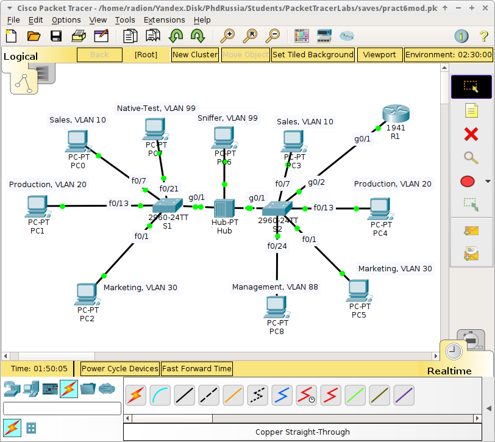
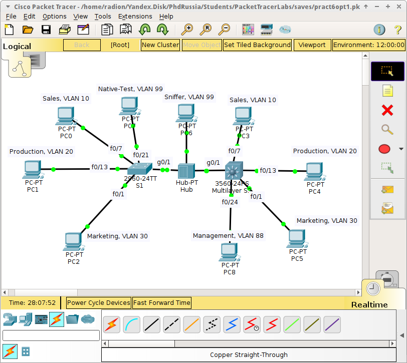

pr6-vlan-marshrutizatsiya

# Практическая работа №6. Маршрутизация между VLAN

Цель: изучить принципы маршрутизации между VLAN.

Для того, чтобы передавать информацию между VLAN, необходимо использовать либо роутер, либо коммутатор 3-го уровня \(L3-switch\), для настройки так называемого inter-VLAN routing.

В начале становления маршрутизации между VLAN, использовалось столько же портов роутера, сколько было VLAN, т.е. каждый порт свитча \(отвечающего за один VLAN\) подключался к одному порту роутера, который выполнял осуществлял маршрутизацию между VLAN. Более современной концепцией маршрутизации является _Router-on-a-Stick_, когда свитч подключается только по одному интерфейсу к роутеру в режиме Trunk, а маршрутизация осуществляется через виртуальные интерфейсы роутера – sub-interfaces, правда при этом канал между роутером и свитчом становится узким местом в сети. В случае же использования свитча 3-го уровня нужда в роутере отпадает, т.к. маршрутизация теперь осуществляется внутри этого же свитча, но такое решение может сделать сеть дороже.

## Router-on-a-Stick

Для реализации Router-on-a-Stick, каждый из под-интерфейсов роутера должен быть настроен в соответствии с IP-адресацией каждого VLAN \(адрес, маска, тэгирование\). Например:

```
R1(config)# interface g0/0.10 % переходим к настройке 10-го под-интерфейса (обычно ==VLAN-ID) порта g0/0
R1(config-subif)# encapsulation dot1q 10 % активируя работу с тегированными кадрами, явно указываем номер VLAN (native м.б. также использован)
R1(config-subif)# ip address 192.168.10.1 255.255.255.0 %указываем адрес и маску этого под-интерфейса
```

> В случае Native VLAN, необходимо выполнять:
>
> ```
> R1(config-subif)# encapsulation dot1q VLAN-ID native
> ```

Этот процесс повторяется для всех под-интерфейсов, чтобы их активировать, необходимо выполнить _no shutdown_ на физическом порту:

```
R1(config)# interface g0/0
R1(config-if)# no shutdown
```

При этом, отдельные под-интерфейсы могут быть деактивированы командой _shutdown._

Обязательным условием является настройка Trunk-порта на коммутаторе, подключаемого к маршрутизатору, которая должна быть аналогична существующим тегированным портам. Далее становится возможной маршрутизация между VLAN, если они подключены ** непосредственно ** к роутеру.

Типичные ошибки при конфигурации:

* Trunk не активирован на линке, связующем свитч и роутер

* Несоответствие номера VLAN на свитче и роутере

* Некорректная настройка IP-адресации на роутере

## L3-switching

Как уже было упомянуто, коммутаторы с поддержкой функционала 3-го уровня могут быть использованы для маршрутизации между VLAN, что реализуется посредством использования Switch Virtual Interfaces -- виртуальных интерфейсов коммутатора. При этом, достаточно чтобы только один из коммутаторов в сети обладал L3-функционалом.

> Подобный функционал может быть активирован на свитче Cisco 3560.

Для активации функционала маршрутизации на коммутаторе необходимо выполнить команду:

```
S2_L3(config)#ip routing
```

Настройка VLAN на Cisco 3560 аналогична модели 2960 из предыдущей работы, однако при активации режима Trunk на порте необходимо явно указать тип инкапсуляции данных:

```
S2_L3(config-if)#switchport trunk encapsulation dot1q
S2_L3(config-if)#switchport mode trunk
```

После этого, необходимо создать и настроить SVI \(как это делали в ПР3\) для каждого VLAN. При этом, в качестве IP-адреса нужно указывать адрес шлюза по умолчанию в данном VLAN. Пример настройки:

```
S2_L3(config)#interface vlan 10    %активация SVI
S2_L3(config-if)#ip address 192.168.10.1 255.255.255.0
```

На этом этапе маршрутизация между VLAN должна работать.

**Верификация настроек** может проделана следующими командами как на роутере так и на L3-свитче:

```
R1# show ip route % для верификации таблицы маршрутизации,непосредственно подключённые маршруты обозначаются как «С»
R1# show ip interface brief % выполнять для проверки настроек под-интерфейсов или SVI
R1# show running-config | begin interface %отображает конфигурацию интерфейсов
```

**Задание**

1. Собрать сеть как показано на рисунке ниже:




2. В соответствии с планом адресации из предыдущей работы и таблицы ниже, настроить inter-VLAN routing на R1 используя концепцию Router-on-a-Stick:

| **Device** | **Interface** | **IP Address** | **Subnet Mask** | **dot1q** |
| :--- | :--- | :--- | :--- | :--- |
|  | G0/1.10 | 192.168.10.1 | 255.255.255.0 | 10 |
|  | G0/1.20 | 192.168.20.1 | 255.255.255.0 | 20 |
| R1 | G0/1.30 | 192.168.30.1 | 255.255.255.0 | 30 |
|  | G0/1.88 | 192.168.88.1 | 255.255.255.0 | 88 |
|  | G0/1.99 | 192.168.99.1 | 255.255.255.0 | 99 |

3. Проверить таблицу маршрутизации и работоспособность сети.

4. Создать новую версию сети, где удален маршрутизатор R1, а коммутатор S2 Cisco 2960 заменен на Cisco 3560:



5. Провести настройку нового коммутатора используя конфигурацию аналогичную заменённому.

> Можно скопировать вывод _show running-config_ старого свитча и скопировать его на новый в режиме глобальной конфигурации.

6. Провести настройку inter-VLAN routing используя данные из таблицы выше.

7. Проверить таблицу маршрутизации и работоспособность сети.

8. Сделать выводы

