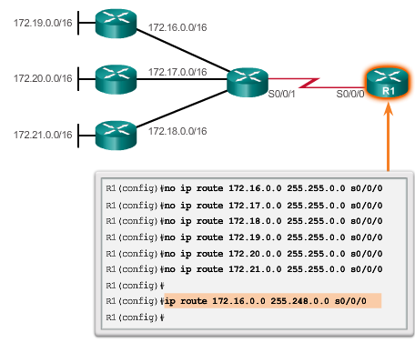
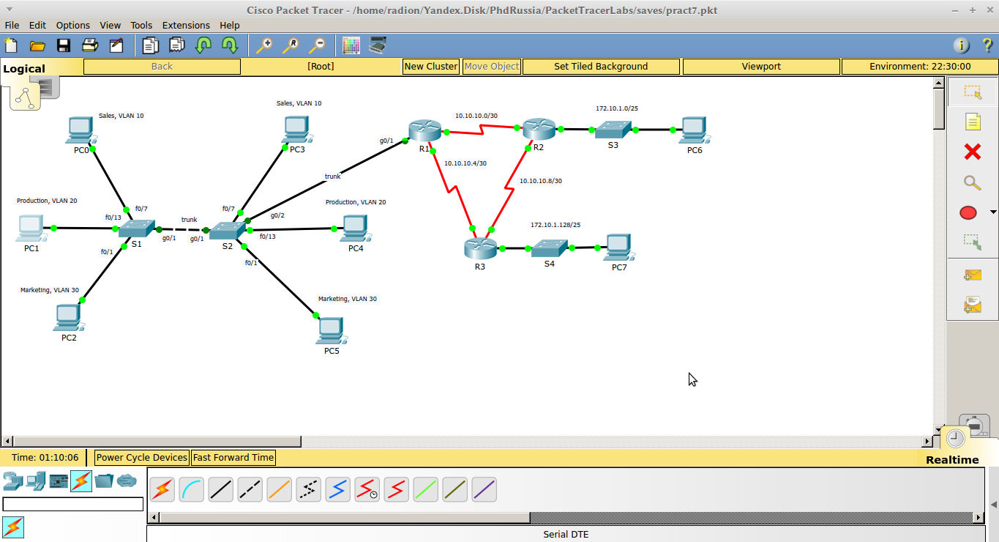

pr7-staticheskaya-marshrutizatsiya

# **Практическая работа №7. Статическая маршрутизация**

Цель: изучить принципы работы статической маршрутизации и получить навыки конфигурации статических маршрутов.

Маршрутизация бывает 2-х видов: статические и динамическая. При этом, статическая маршрутизация обладает следующими преимуществами:

* маршруты не объявляются в сети – лучшая безопасность;

* меньшее потребление ресурсов сети и ЦП по сравнению с динамическими протоколами;

* маршрут заранее известен.

Но конфигурация статических маршрутов сложнее и тяжело масштабируема – вероятность ошибки при настройке гораздо выше. Обычно, статическая маршрутизация используется в маленьких сетях, при необходимости жёстко задать маршрут \(к Интернет-провайдеру, например\), при резервировании маршрутов \(на случай отказа какого-либо узла связи\). Различают 4 типа статических маршрутов:

1. Стандартный;
2. По умолчанию;
3. Суммарный; 
4. "Плавающий".

**Стандартный тип** используется для подключения к какой-либо определённой сети. Обычное применение – когда существует только один маршрут в принципе, либо, когда роутер связан только с одним роутером. Суммарный маршрут применяется, когда сети назначения имеют смежные адреса и могут быть объединены общим адресом или когда несколько маршрутов имеют общий выходной интерфейс или адреса следующего шлюза. Плавающий маршрут используется при резервировании основного маршрута и, следовательно, должен быть настроен с большим административным расстоянием.

`Router(config)# ip route network-address subnet-mask { ip-address | interface-type interface-number [ ip-address ]} [ distance ] [namename ] [permanent] [tagtag ]`

Маршруты могут быть заданы указанием пути к сети через выходной интерфейс, через адрес следующего узла либо оба варианта одновременно. Пример конфигурации маршрута через интерфейс \(рекомендуется использовать только в случаях подключений типа точка-точка\):

`Router(config)# ip route 192.168.2.0 255.255.255.0 GigabitEthernet 0/1`

Рекомендуется проводить конфигурацию полного маршрута \(адрес и интерфейс\) либо с указанием по крайней мере адреса следующего узла:

`Router(config)# ip route 192.168.2.0 255.255.255.0 GigabitEthernet 0/1 192.168.2.1`

`Router(config)# ip route 192.168.2.0 255.255.255.0 192.168.2.1`

Для проверки статических маршрутов выполняется:

`Router# show ip route static`

Можем просматривать также маршруты только определённых сетей

`Router# show ip route 192.168.2.1`

**Маршруты по умолчанию** совпадают со всеми адресами. Если какой-либо из маршрутов не совпадает с записями в таблице маршрутизации, то пакеты посылаются по маршруту по умолчанию через «шлюз последней надежды» \(gateway of last resort\):

`Router(config)# ip route 0.0.0.0 0.0.0.0{ ip-address | exit-intf }`

Обычно такие маршруты прописываются на пограничных/тупиковых узлах \(uplinkк провайдеру\).

В тех случаях, когда сети со смежными адресами доступны через один интерфейс, возможна настройка **суммарного маршрута** \(см. Рисунок ниже\), таким образом, что все записи этих сетей в таблице маршрутизации заменяются одной. Для этого необходимо вычислить суммарный маршрут, расписав адреса сетей в двоичном виде и найти общую часть битов в сетевой части, при этом количество общих битов определяет маску. Результирующая маска перемножается с любым из адресов, результат – суммарный маршрут. Пример вычисления для сети с 27-й маской:

172.22.1.128:**10101100.00010110.00000001.10**000000

172.22.1.160:**10101100.00010110.00000001.10**100000

Результат:172.22.1.128/26





**«Плавающие» маршруты** \(floating route\) настраиваются в целях резервирования. Например, если основный маршрут станет недоступным, «плавающий» маршрут активируется. Обычно, такие маршруты резервируют динамически изученные маршруты \(OSPG,EIGRP\). Это достигается за счет установки административного расстояния большего, чем у основного. Административное расстояние показывает насколько авторитетным является тот или иной способ получения маршрута \(меньше значение – больше авторитетность\), например, статические маршруты к одним и тем же сетям обладают меньшим административным расстоянием, чем любой динамический маршрут. Примеры административных расстояний у динамических протоколов: EIGRP = 90, IGRP = 100, OSPF = 110, IS-IS = 115, RIP = 120. Для конфигурации подобного маршрута, наряду с обычным параметрами указывается:

```
Router(config)# ip route 0.0.0.0 0.0.0.0{ ip-address | exit-intf } AD % где AD – административное расстояние (целое число)
```

В целях диагностики маршрутов \(трассировка промежуточных узлов\) выполняются следующие команды:

`Router# tracerouteip-address %на устройстве Cisco`

`C:\>tracert ip-address %Windows`

**Задание**

1. Собрать сеть как на Рисунке ниже. Для этого необходимо выключить роутеры и добавить по модулю HWIC-2T и заново включить.!



[](/assets/pr7topo.png)  
2. Подключить и настроить интерфейсы роутеров в соответствии с планом адресации из Таблицы:

| **Device** | **Interface** | **IP Address** | **Subnet Mask** | **Default GW** |
| :--- | :--- | :--- | :--- | :--- |
| PC6 | F0/0 | 172.10.1.60 | 255.255.255.128 | 172.10.1.1 |
| PC7 | F0/0 | 172.10.1.160 | 255.255.255.128 | 172.10.1.129 |
| R3 | S0/1/0 | 10.10.10.6 | 255.255.255.252 | N/A |
|  | S0/1/1 | 10.10.10.10 | 255.255.255.252 | N/A |
|  | G0/0 | 172.10.1.129 | 255.255.255.128 | N/A |
| R2 | S0/1/0 | 10.10.10.2 | 255.255.255.252 | N/A |
|  | S0/1/1 | 10.10.10.9 | 255.255.255.252 | N/A |
|  | G0/1 | 172.10.1.1 | 255.255.255.128 | N/A |
| R1 | S0/1/0 | 10.10.10.1 | 255.255.255.252 | N/A |
|  | S0/1/1 | 10.10.10.5 | 255.255.255.252 | N/A |
|  | G0/1 | -- | -- | см. пред. работу |


3. Посчитать суммарный маршрут для домена сети с VLAN. Примечание: хотя адреса сетей в этом домене не смежные, в целях обучения это допускается.

4. На роутерах настроить статические и суммарный маршруты указанием следующего узла для сетей с множеством узлов, и через указание выходного интерфейса для сетей включённых в соединение точка-точка.

5. Проверить доступность ПК в сети командой ping.

6. Проверить таблицы маршрутизации на роутерах.

7. Описать маршрут пакетов \(названиями узлов\) при выполнении команды tracert на ПК1 до ПК7.

8. Сделать выводы
