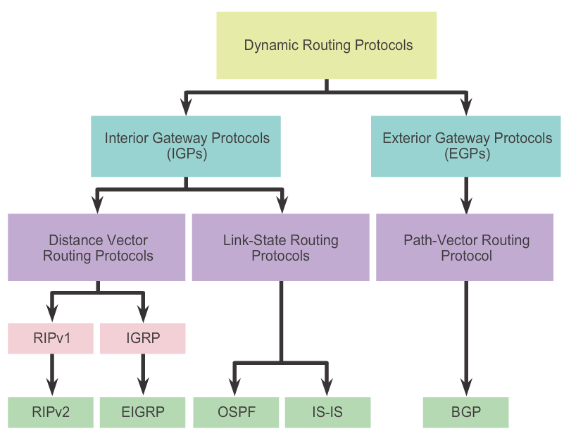

pr8-ospf

# Практическая работа №8. Протокол OSPF

Цель: изучить принципы динамической маршрутизации на примере OSPF и реализовать в Packet Tracer.

С ростом размеров сети, поддержка и настройка статических маршрутов становится сложной задачей. Для того, чтобы автоматизировать настройку маршрутов в сети, были разработаны протоколы динамической маршрутизации. В отличие от статической маршрутизации, динамическая потребляет гораздо больше вычислительных и сетевых ресурсов. Классификация динамических протоколов маршрутизации по домену применения, типу алгоритма и их примеры приведены на Рисунке ниже. Автономная система \(АС\) – группа роутеров, управляемых одной компанией \(сеть предприятия, провайдера\). Interior Gateway Protocol \(IGP\) протоколы обеспечивают маршрутизацию внутри АС, а Exterior GP \(EGP\) – между АС.




Динамические протоколы маршрутизации выполняют следующие функции:

* объявление непосредственно подключённых сетей на устройстве;

* поддержка таблицы маршрутизации в актуальном состоянии;

* выбор оптимального маршрута;

* поиск нового оптимального маршрута, при изменениях в сети.

Векторные протоколы знают только расстояние до желаемой сети и направление \(выходной интерфейс и next hop\), не зная всей топологии сети, в отличие от Link-State протоколов.

Для осуществления подобного функционала, протоколы используют таблицы/базы данных \(для хранения информации\), особый тип IP-пакетов и алгоритм для поиска маршрутов. В больших сетях, имеет смысл разбивки сети \(АС\) на домены маршрутизации, в том числе для уменьшения объёмов вычислений при формировании маршрутов. Таким образом, в каждом домене формируется свой Link-state Database \(LSDB\), эти домены иерархически связываются с опорным доменом \(backbone area\), который обеспечивает связь между доменами маршрутизации. Роутеры, связывающие домены, в OSPF называются Area Border Routers \(ABRs\).

При инициализации, роутеры сначала добавляют в таблицу маршрутизации только непосредственно подключённые сети. Далее, формируется пакет обновлений, который через все интерфейсы отправляется с данными обо всех непосредственно подключённых сетях, кроме сети выходного интерфейса. Таблица маршрутизации актуализируется и формируется новый пакет обновлений. Процесс продолжается до достижения конвергенции \(когда вся информация о сети получена на каждом из устройств\). Наилучшими протоколами в плане достижения конвергенции считаются OSPF, IS-IS, EIGRP.

OSPF протокол в процессе инициализации проходит следующие этапы:

* **Рассылка Hello-сообщений** для установления доступности соседей. В дальнейшем, эти сообщения рассылаются регулярно для проверки доступности соседей. По содержанию Hello-пакетов устанавливается, станут ли роутеры соседями или нет. Для установления соседства небходимо совпадение следующих параметров:
* Area-ID
* Hello/Dead таймеры
* Уникальность Router-ID
* Принадлежность интерфейсов соседей к одной подсети
* Параметры аутентификации

Обычно, Hello-пакеты рассылаются по всем интерфейсам, которые были анонсированы для OSPF, даже если на другом конце линии нет роутера. Процесс рассылки сообщений хостам нежелателен, т.к. вызывает дополнительное потребление ресурсов сети, т.о. подобные интерфейсы следует деактивировать для рассылки Hello-сообщений, но оставив их сети активными для процесса OSPF. Для дезактивация рассылки подобных сообщений можно выполнить команду: 
`Router(config-router)# passive-interface g0/0`

* **Формирование Link-State Advertisements** \(LSAs\), для интерфейсов, где доступны соседи. Обновления содержат параметры подключённых сетей, тип и метрики интерфейсов.

* **Рассылка LSAs всем соседям**, которые их сразу же пересылают уже своим соседям. В случае отсутствия в базе данных роутера -- Link-state Database \(LSDB\) -- информации о какой-либо сети, он отправляет Link-State Request \(LSR\) тому, от кого получил LSA с новой информацией. В ответ ему приходит Link-State Update \(LSU\) c деталями о интересующей сети.

* По окончании рассылки, происходит формирование топологии сети по LSDB и **вычисление кратчайших маршрутов ** с помощью алгоритма Дейкстры.

Настройка маршрутизации OSPF проходит следующим образом:

```
Router(config)# router ospf process-id %process-id не влияет на работу сети, выбирается администратором, обычно присваивают 1
```

Каждому роутеру может быть явно присвоен _Router-ID_ для идентификации роутера в OSPF процессе и для выборов DR \(Designated Router\). По умолчанию, в качестве _Router-ID_ выбирается наибольший IP-адрес активного интерфейса, но при наличии loopback-интерфейса, последний имеет приоритет. Каждый роутер устанавливает таблицу связей \(соседей\), каждому из которых он будет посылать LSA пакеты. При большом количестве роутеров, количество связей растёт согласно _n\(n-1\)/2_ \(_n_ – количество роутеров\), т.е. количество отправок LSA пакетов равно количеству связей, что ведёт к взрывному росту трафика \(flooding of LSAs\) в сети при подключении роутеров в одном широковещательном домене. Для обхода этой проблемы один из роутеров назначается ведущим \(Designated Router\), который управляет процессом пересылки сообщений в домене. Также выбирается резервным ведущий роутер \(Backup DR\), остальные становятся – DROTHER. Процесс выбора происходит по величине Router ID, обладатель наибольшего идентификатора становится DR. Пример настройки Router ID:

`Router(config-router)# router-id 1.1.1.1`

Для объявления доступных сетей для процесса OSPF, необходимо активировать их рассылку следующим образом:

```
Router(config-router)# network network-address wildcard-mask area area-id % в случае сети с одним доменом маршрутизации, принято указывать 0 в качестве area-id, wildcard mask это (255.255.255.255-mask)
```

Можно избежать расчёта маски wildcard, если указать адрес интерфейса, вместо адреса сети:

`Router(config-router)# network interface-ip-address 0.0.0.0 area area-id`

Для оценки маршрутов используются метрики маршрутизации. Они могут быть основаны на разных параметрах, например, количество хопов до сети, пропускная способность линка и т.д. В OSPF в качестве метрики используется пропускная способность канала связи и расчитывается по формуле:


$$
metric=\frac{100 [Мбит/с]}{Пропускная Способность Канала[Мбит/с]}
$$


С учетом тrого, что метрика может быть только целым числом, для каналов построенных на FastEthernet и GigabitEthernet, она будет равна 1. Для обхода этого ограничения, необходимо скорректировать числитель выражения в сторону увеличения:

`Router(config-router)auto-cost reference-bandwidth XX %XX -- скорость в Мбит/с`

После конфигурации маршрутизации и для проверки работы OSPF следует выполнять следующие команды:

```
Router# show ip ospf neighbor %показывает соседей, с которыми сформированы связи
Router# show ip ospf interface brief %итог настройки интерфейсов с OSPF
Router# show ip protocols
Router# show ip ospf
```

**Задание**

1. Прежде чем выполнять работу, убедитесь, что статические маршруты удалены.

2. Используя топологию сети и план адресации из ПР №7, настроить OSPF маршрутизацию на роутерах, указав area 0, Router ID — выбрать самостоятельно, но таким образом, чтобы последний октет совпадал с номером роутера. Отключить лишние интерфейсы от процесса рассылки сообщений Hello.

3. Проверить работоспособность сети, выполнив диагностические команды.

4. Сделать выводы.
